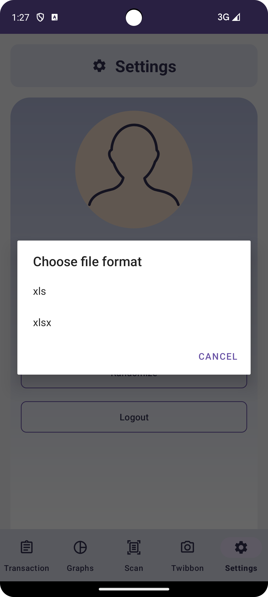

# BondoMan
Aplikasi BondoMan merupakan aplikasi Android untuk manajemen keuangan yang dibuat menggunakan kotlin

## Deskripsi 
Aplikasi ini memiliki fitur-fitur berikut:
- Menambah, mengedit, dan menghapus transaksi
- Melihat riwayat transaksi
- Memindai nota
- Melihat grafik ringkasan transaksi
- Mengekspor data transaksi ke dalam format XLS/XLSX
- Mengirim data transaksi melalui email
- Mengacak pembuatan transaksi
- Pengecekan konektivitas jaringan
- Pemeriksaan Login & Kedaluwarsa JWT menggunakan background service

## Library yang digunakan
Berikut adalah library yang digunakan dalam proyek ini:
- AndroidX Annotation
- AndroidX AppCompat
- AndroidX Camera Camera2
- AndroidX Camera Core
- AndroidX Camera Lifecycle
- AndroidX Camera View
- AndroidX Core KTX
- AndroidX ConstraintLayout
- AndroidX Lifecycle LiveData KTX
- AndroidX Lifecycle ViewModel KTX
- AndroidX Navigation Fragment KTX
- AndroidX Navigation UI KTX
- AndroidX Room KTX
- AndroidX Test Espresso Core
- AndroidX Test JUnit
- Apache POI
- Apache POI OOXML
- Google Play Services Location
- Google Material
- JUnit
- Kotlinx Coroutines Android
- Kotlinx Coroutines Core
- MPAndroidChart
- OkHttp
- Retrofit
- Retrofit Converter Gson

## Screenshots
- Splash Screen

- Greetings Screen

- Login Screen

- Transaction List

- Add/Edit Transaction

- Graph

- Scan Nota

- Settings

- Email, XLSX

- Randomize

- [BONUS] Twibbon

